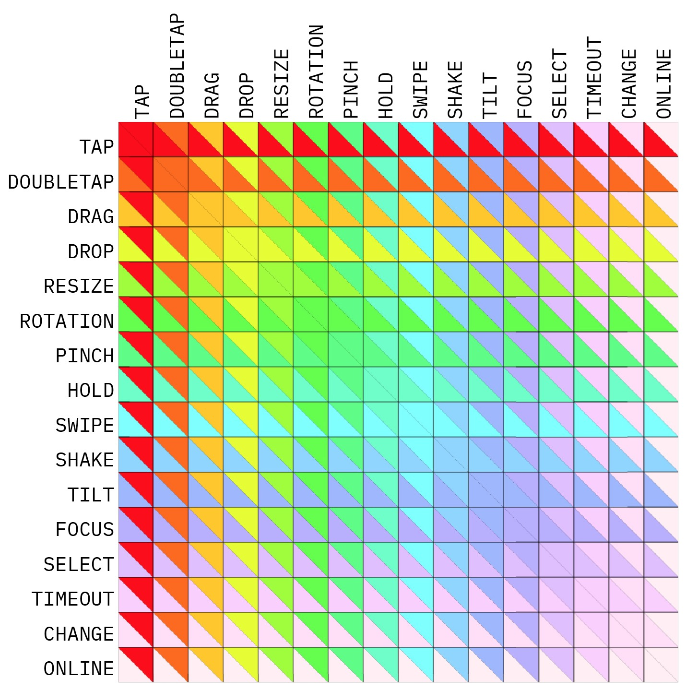

# Atelier programmation
## ::: B  R  I  E  F  I  N  G ::: 256  x   256   x  256
E  S  A     ·     A  N  1  ·    ·    ·  0  1  /  0  2  /  1  9     ·     0  8  /  0  3  /  1  9 

* [Objectifs](#objectifs-)
* [Contraintes ](#contraintes-)
* [En classe](#en-classe-)
* [Chez vous](#chez-vous-)
* [Description](#description-)
* [Règles](#règles-)
* [Nomenclature](#nomenclature-)
* [attributions](#attributions-)
* [Lien vers l'app](#lien-vers-lapp-)

### OBJECTIFS :    
* Produire à 26, 256 espaces interactifs dont la dimension est fixée à 256 pixels sur 256 pixels.
* Explorer le potentiel de 16 interactions avec un écran mobile.
* Développer nos compréhensions du potentiel de l'environnement web.
* Collaborer et s'identifier par rapport aux autres, en créant des espaces différents dans un but commun avec une structure commune.
* Réflexion sur le design «call to action» clair, 
    * Rapide à comprendre
    * Efficace
* **Nous exposons ce projet commun produit de nos individualités aux portes ouvertes de l’école**.

### CONTRAINTES : 
* **Techno :** WEB > HTML + CSS + Javascript
* **Dimension :** 256 x 256 pixels
* **Durée :** chacun des espaces sera vu par l'utilisateur 14 secondes
* **Quantité :** chacun de vous développe au minimum 10 espaces interactifs
* **Interaction :** chaque espace interactif demande à l'utilisateur de produire 2 actions dans un certain ordre

### EN CLASSE :   
* Nous explorons chacune de ces interactions :
    * Définition
    * Technique
    * Utilisation
* Nous mettons en place un canvas de développement de vos espaces interactifs.
* Nous répondons aux questions relatives à votre production.
* Nous discutons de la pertinence de votre production.
* Nous mettons en place un dispositif capable de parcourir ces espaces interactifs.

### CHEZ VOUS :   
* Vous conceptualisez vos 10 espaces interactifs
* Vous dessinez vos 10 espaces interactifs
* Vous développez vos 10 espaces interactifs

### DESCRIPTION : 
|   ID  | Action      | Définition           |
|:-----:|:----------- | -------------------- |
| **0** | `TAP`       | L’utilisateur __click avec un doigt__ sur un objet |
| **1** | `DOUBLETAP` | L’utilisateur `TAP` __2x__ en peu de temps sur un objet |
| **2** | `DRAG`      | L’utilisateur met un doigt sur un objet et le __glisse__ |
| **3** | `DROP`      | L’utilisateur, après un `DRAG` __relâche son doigt pour placer l’objet à un endroit voulu__ |
| **4** | `RESIZE`    | L’utilisateur __agrandit__ ou __rétrécit__ un objet en __glissant son doigt sur un bord d’un objet__ |
| **5** | `ROTATION`  | L’utilisateur __fait tourner plusieurs doigts__ sur l'écran |
| **6** | `PINCH`     | L’utilisateur __écarte ou rapproche plusieurs doigts__ sur l’écran |
| **7** | `HOLD`      | L’utilisateur __presse un certain temps__ sur un objet |
| **8** | `SWIPE`     | L’utilisateur __glisse vigoureusement un doigt__ dans une direction |
| **9** | `SHAKE`     | L’utilisateur __secoue__ son écran |
| **A** | `TILT`      | L’utilisateur __change l'orientation__ de son écran |
| **B** | `FOCUS`     | L’utilisateur __revient sur l'onglet__ contennant votre application |
| **C** | `SELECT`    | L’utilisateur __sélectionne du texte__ présent sur la page |
| **D** | `TIMEOUT`   | L’utilisateur __attend__ un certain temps |
| **E** | `CHANGE`    | L’utilisateur __change le contenu__ d’un champs de formulaire |
| **F** | `ONLINE`    | L’utilisateur __récupère une connexion internet__ |

### RÈGLES : 
* L'utilisateur a pour but de **parcourir en moins d'une heure les 256 espces interactifs.**
* Pour cela, il dispose d'une page web qui encapsule tout ces espaces interactifs, appelons la : **Mécanique temporelle**.
* Au commencemant, la Mécanique temporelle affiche un espace interactif tiré au hazard. L'utilisateur doit alors **accomplir deux actions**. 
* Si l'utilisateur parvient à accomplir dans l'ordre les deux actions assignées à cet espace, **la Mécanique temporelle est notifiée. Elle referme cet espace, en sélectionne un nouveau encore à résoudre** et l'histoire continue. `top.postMessage('SUCCESS', '*');`
* Si l'utilisateur ne parvient pas à résoudre cet espace en moins de 14 secondes, alors **la Mécanique temporelle referme cet espace et ouvre l'espace précédent.** 

### NOMENCLATURE : 
Chaque espace est nomé suivant la règle suivante :  
"0x"+`Id_Action_1`+`Id_Action_2`
> _exemple :_  
> ... la première action à acomplir est `SWIPE` qui à pour Id **8** 
> ... la seconde action à acomplir est `TILT` qui à pour Id **A** 
> ... cet espace porte le nom **0x8A**

### ATTRIBUTIONS :
La colonne Acronyme vous iditifie, elle contient des trigrammes composés au moyen de vos prénoms et noms. La première lettre du prénom suivit des 2 premières lettres du nom de famille. Pour les noms composés, on prend la première lettre de chaque partonyme jusqu'à composition du trigramme.
> _exemple :_  
> ... Vincent Evrard - **VEV**

|  Trigramme | Espaces à votre charge   |
|:---------- |:------------------------ |
| **GAN** | [`0x03`](./src/0x03)  [`0xD1`](./src/0xD1)  [`0xEC`](./src/0xEC)  [`0xC6`](./src/0xC6)  [`0x9E`](./src/0x9E)  [`0x16`](./src/0x16)  [`0xB5`](./src/0xB5)  [`0xA4`](./src/0xA4)  [`0xEA`](./src/0xEA)  [`0xFD`](./src/0xFD)  |
| **EBE** | [`0xCE`](./src/0xCE) [`0xE1`](./src/0xE1) [`0xBF`](./src/0xBF) [`0x25`](./src/0x25) [`0x18`](./src/0x18) [`0xE0`](./src/0xE0) [`0xDB`](./src/0xDB) [`0x94`](./src/0x94) [`0xEB`](./src/0xEB) [`0xE7`](./src/0xE7) |
| **KBL** | [`0x85`](./src/0x85) [`0x43`](./src/0x43) [`0x7F`](./src/0x7F) [`0x5F`](./src/0x5F) [`0xB7`](./src/0xB7) [`0x2D`](./src/0x2D) [`0xB0`](./src/0xB0) [`0x98`](./src/0x98) [`0x90`](./src/0x90) [`0x4C`](./src/0x4C) |
| **CCO** | [`0x02`](./src/0x02) [`0x96`](./src/0x96) [`0xAE`](./src/0xAE) [`0x3F`](./src/0x3F) [`0x84`](./src/0x84) [`0x2C`](./src/0x2C) [`0x65`](./src/0x65) [`0xAB`](./src/0xAB) [`0xBE`](./src/0xBE) [`0xDC`](./src/0xDC) |
| **KDG** | [`0xC4`](./src/0xC4) [`0xE3`](./src/0xE3) [`0x82`](./src/0x82) [`0x11`](./src/0x11) [`0x0E`](./src/0x0E) [`0xE4`](./src/0xE4) [`0xD2`](./src/0xD2) [`0xCC`](./src/0xCC) [`0x6C`](./src/0x6C) [`0x4F`](./src/0x4F) |
| **DDM** | [`0xC9`](./src/0xC9) [`0x21`](./src/0x21) [`0xA0`](./src/0xA0) [`0x63`](./src/0x63) [`0x6E`](./src/0x6E) [`0x4A`](./src/0x4A) [`0x8B`](./src/0x8B) [`0x97`](./src/0x97) [`0xA6`](./src/0xA6) [`0x2B`](./src/0x2B) |
| **LDG** | [`0x5A`](./src/0x5A) [`0x92`](./src/0x92) [`0xAF`](./src/0xAF) [`0x20`](./src/0x20) [`0x31`](./src/0x31) [`0x6F`](./src/0x6F) [`0xEF`](./src/0xEF) [`0xE8`](./src/0xE8) [`0xA9`](./src/0xA9) [`0x7E`](./src/0x7E) |
| **SDU** | [`0xFA`](./src/0xFA) [`0x7B`](./src/0x7B) [`0x41`](./src/0x41) [`0x72`](./src/0x72) [`0x3D`](./src/0x3D) [`0x19`](./src/0x19) [`0x08`](./src/0x08) [`0xA1`](./src/0xA1) [`0xDF`](./src/0xDF) [`0xF7`](./src/0xF7) |
| **VHA** | [`0xB8`](./src/0xB8) [`0x99`](./src/0x99) [`0xDE`](./src/0xDE) [`0xC1`](./src/0xC1) [`0xBF`](./src/0xBF) [`0x86`](./src/0x86) [`0x36`](./src/0x36) [`0x17`](./src/0x17) [`0xC7`](./src/0xC7) [`0x4E`](./src/0x4E) |
| **JHU** | [`0x60`](./src/0x60) [`0xD0`](./src/0xD0) [`0x33`](./src/0x33) [`0x0A`](./src/0x0A) [`0xC3`](./src/0xC3) [`0xD6`](./src/0xD6) [`0x54`](./src/0x54) [`0x77`](./src/0x77) [`0xB2`](./src/0xB2) [`0x7D`](./src/0x7D) |
| **MJU** | [`0xCB`](./src/0xCB) [`0x58`](./src/0x58) [`0xE5`](./src/0xE5) [`0x27`](./src/0x27) [`0x88`](./src/0x88) [`0xC5`](./src/0xC5) [`0xB3`](./src/0xB3) [`0x57`](./src/0x57) [`0x5B`](./src/0x5B) [`0x04`](./src/0x04) |
| **MLE** | [`0x53`](./src/0x53) [`0x12`](./src/0x12) [`0xE2`](./src/0xE2) [`0xDD`](./src/0xDD) [`0x2A`](./src/0x2A) [`0xF9`](./src/0xF9) [`0x87`](./src/0x87) [`0x6A`](./src/0x6A) [`0x1A`](./src/0x1A) [`0x30`](./src/0x30) |
| **LLE** | [`0x64`](./src/0x64) [`0x07`](./src/0x07) [`0x55`](./src/0x55) [`0xC0`](./src/0xC0) [`0xCA`](./src/0xCA) [`0x32`](./src/0x32) [`0x35`](./src/0x35) [`0x5D`](./src/0x5D) [`0x83`](./src/0x83) [`0x75`](./src/0x75) |
| **LLI** | [`0x91`](./src/0x91) [`0xA2`](./src/0xA2) [`0xAA`](./src/0xAA) [`0x68`](./src/0x68) [`0x8F`](./src/0x8F) [`0xF6`](./src/0xF6) [`0x50`](./src/0x50) [`0xF0`](./src/0xF0) [`0x62`](./src/0x62) [`0xB1`](./src/0xB1) |
| **TMA** | [`0x38`](./src/0x38) [`0x5C`](./src/0x5C) [`0x44`](./src/0x44) [`0x01`](./src/0x01) [`0x52`](./src/0x52) [`0x59`](./src/0x59) [`0x00`](./src/0x00) [`0x8F`](./src/0x8F) [`0x46`](./src/0x46) [`0x7A`](./src/0x7A) |
| **APA** | [`0x9F`](./src/0x9F) [`0x28`](./src/0x28) [`0x10`](./src/0x10) [`0x66`](./src/0x66) [`0x2F`](./src/0x2F) [`0xBD`](./src/0xBD) [`0xBA`](./src/0xBA) [`0x24`](./src/0x24) [`0x78`](./src/0x78) [`0x74`](./src/0x74) |
| **JPA** | [`0xC2`](./src/0xC2) [`0xCD`](./src/0xCD) [`0xBB`](./src/0xBB) [`0x6B`](./src/0x6B) [`0x40`](./src/0x40) [`0x5E`](./src/0x5E) [`0x3C`](./src/0x3C) [`0x8A`](./src/0x8A) [`0xF4`](./src/0xF4) [`0x61`](./src/0x61) |
| **JPF** | [`0x9D`](./src/0x9D) [`0x9C`](./src/0x9C) [`0x73`](./src/0x73) [`0x9A`](./src/0x9A) [`0x2E`](./src/0x2E) [`0x0C`](./src/0x0C) [`0x0B`](./src/0x0B) [`0xD9`](./src/0xD9) [`0xA7`](./src/0xA7) [`0x4B`](./src/0x4B) |
| **JRI** | [`0xD3`](./src/0xD3) [`0x8E`](./src/0x8E) [`0xDA`](./src/0xDA) [`0x3A`](./src/0x3A) [`0x67`](./src/0x67) [`0x84`](./src/0x84) [`0x47`](./src/0x47) [`0x13`](./src/0x13) [`0x79`](./src/0x79) [`0x76`](./src/0x76) |
| **MSM** | [`0xF3`](./src/0xF3) [`0x39`](./src/0x39) [`0xA8`](./src/0xA8) [`0x09`](./src/0x09) [`0xF5`](./src/0xF5) [`0x23`](./src/0x23) [`0xD8`](./src/0xD8) [`0xB4`](./src/0xB4) [`0xED`](./src/0xED) [`0x8C`](./src/0x8C) |
| **JSE** | [`0x14`](./src/0x14) [`0x49`](./src/0x49) [`0x22`](./src/0x22) [`0x89`](./src/0x89) [`0xEE`](./src/0xEE) [`0x8D`](./src/0x8D) [`0x51`](./src/0x51) [`0xFC`](./src/0xFC) [`0x61`](./src/0x61) [`0xCF`](./src/0xCF) |
| **KSI** | [`0xA3`](./src/0xA3) [`0x15`](./src/0x15) [`0x3E`](./src/0x3E) [`0x3B`](./src/0x3B) [`0x0D`](./src/0x0D) [`0x7C`](./src/0x7C) [`0x42`](./src/0x42) [`0xF2`](./src/0xF2) [`0x29`](./src/0x29) [`0x95`](./src/0x95) |
| **ASI** | [`0xFE`](./src/0xFE) [`0x1E`](./src/0x1E) [`0xD5`](./src/0xD5) [`0x45`](./src/0x45) [`0xBC`](./src/0xBC) [`0x56`](./src/0x56) [`0x6D`](./src/0x6D) [`0xC8`](./src/0xC8) [`0xFF`](./src/0xFF) [`0x9B`](./src/0x9B) |
| **TSI** | [`0xE9`](./src/0xE9) [`0x70`](./src/0x70) [`0x1C`](./src/0x1C) [`0x71`](./src/0x71) [`0xB6`](./src/0xB6) [`0x05`](./src/0x05) [`0x06`](./src/0x06) [`0xAC`](./src/0xAC) [`0xF8`](./src/0xF8) [`0xD7`](./src/0xD7) |
| **JVE** | [`0x4D`](./src/0x4D) [`0x26`](./src/0x26) [`0x69`](./src/0x69) [`0xFB`](./src/0xFB) [`0x81`](./src/0x81) [`0x34`](./src/0x34) [`0x80`](./src/0x80) [`0xB9`](./src/0xB9) [`0x37`](./src/0x37) [`0x1D`](./src/0x1D) |
| **FVU** | [`0x1B`](./src/0x1B) [`0xF1`](./src/0xF1) [`0x48`](./src/0x48) [`0x0F`](./src/0x0F) [`0xA5`](./src/0xA5) [`0xE6`](./src/0xE6) [`0xAD`](./src/0xAD) [`0x1F`](./src/0x1F) [`0x93`](./src/0x93) [`0xD4`](./src/0xD4) |

### LIEN VERS L'APP :
[dat://494cdf7ec87d2542ac01bcc4fd39a3efcfd9d139badc96b911794bd6b1e8ad27/src/0xFFF/](dat://494cdf7ec87d2542ac01bcc4fd39a3efcfd9d139badc96b911794bd6b1e8ad27/src/0xFFF/)

### LICENCE : 

